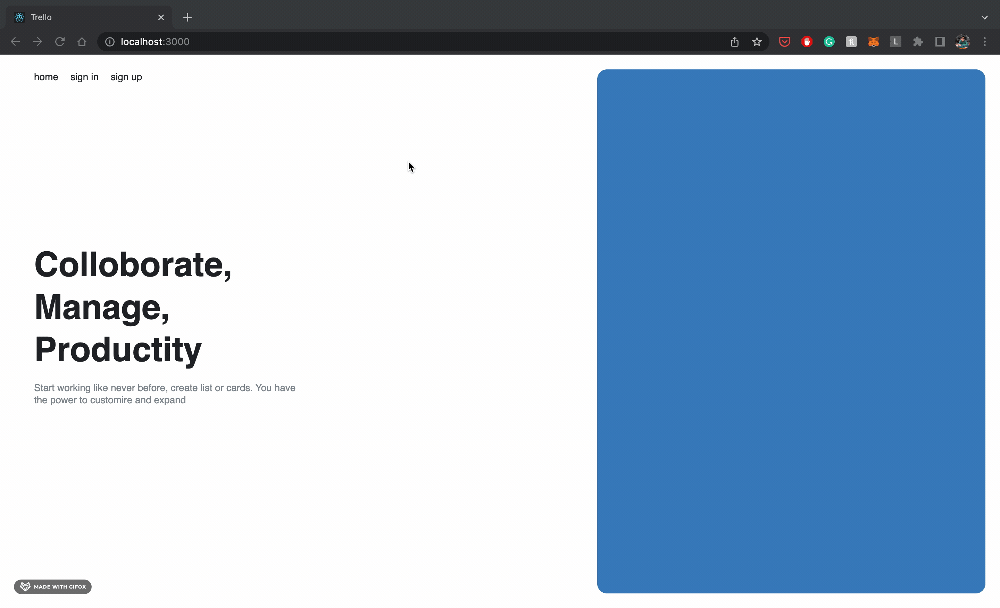

# Trello clone

---

A Trello clone made using NodeJS, ExpressJS, SocketIO, React, Redux, MongoDB

---

## Features

- Authentication
  - enabled using JWT
  - added refresh token mechanism
- Boards
  - create a new board
  - update or delete board by admin only
  - share board with other users
    - accept or decline the invitation
    - leave board
  - add favourite tag to board
  - List
    - create, update and delete list
    - reorder list
  - Card
    - create update and delete card
    - reorder card within list and among lists
- Real time update
  - invitations
  - board details

---

## ToDo

- add user settings
- Manage activity of a board
- Add a attachment to a card
- change background using unsplash api

---

## Screenshots

- Landing
  

- Signup and login
  

- Share board
  

- Board / List / Card
  

- Reordering
  
